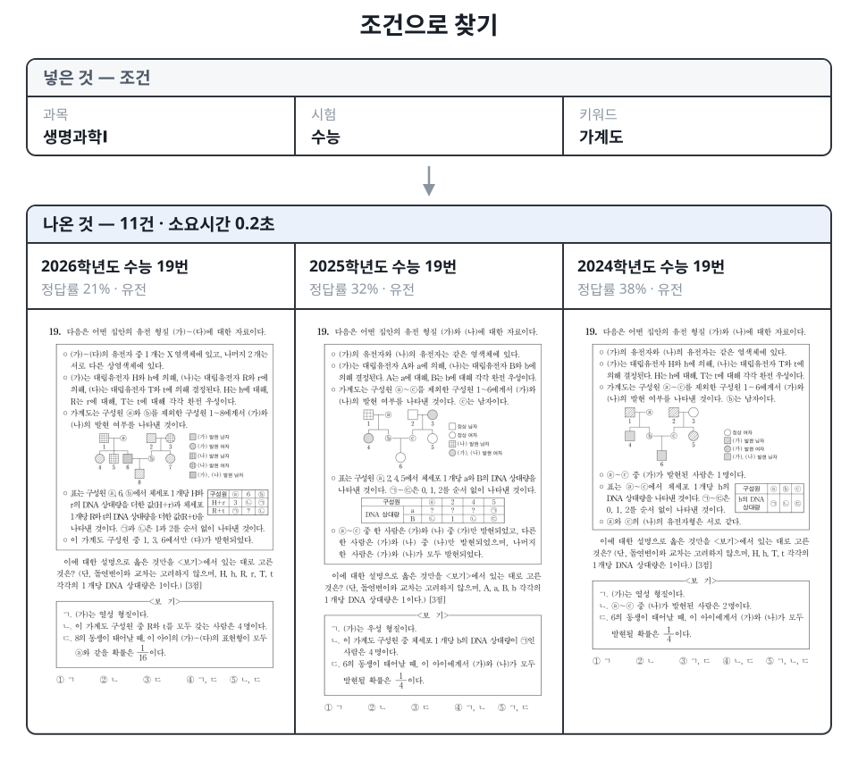
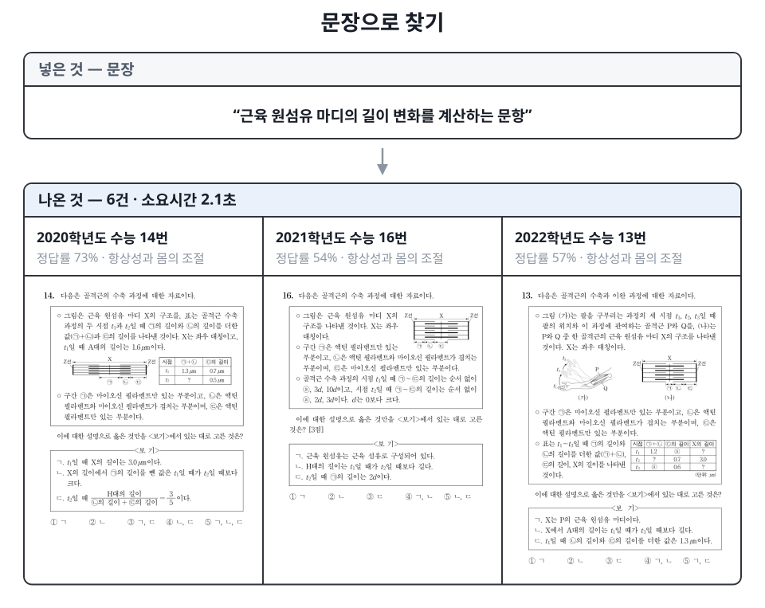
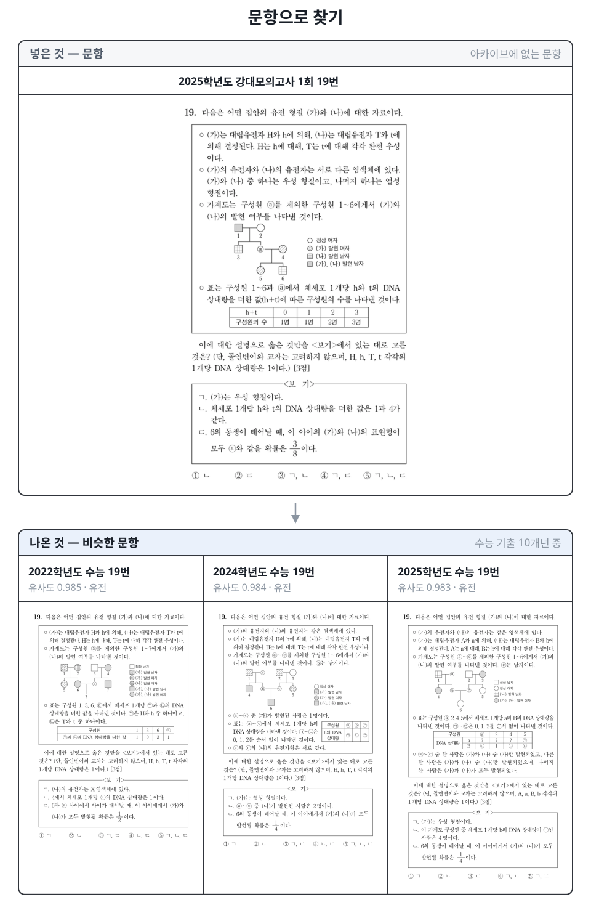
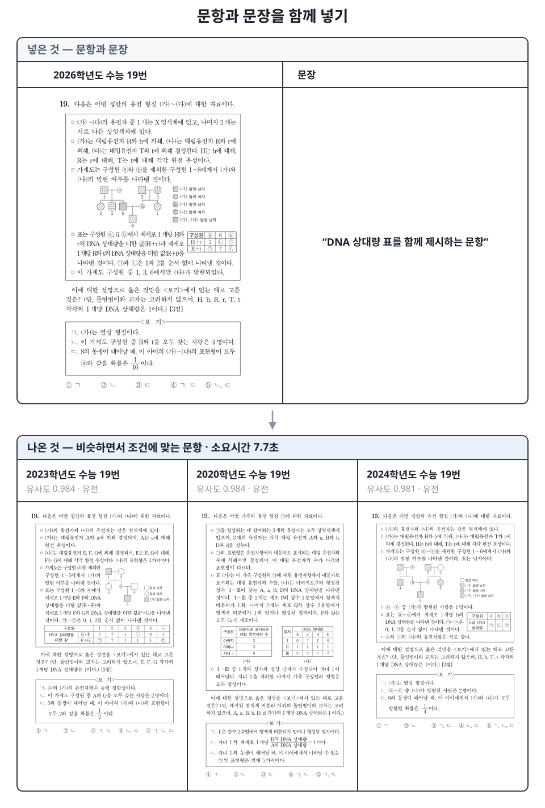

> Archive는 [API](../archive.html)와 [MCP](../mcp-setup.html) 양쪽으로 제공됩니다. 사용 방법은 해당 페이지를 참고해 주세요.

출제나 검토를 하다 보면 필요한 문항을 찾는 일에 생각보다 많은 시간이 듭니다. 작년 9월 모평에서 비슷한 문항을 본 것 같은데 어느 폴더 파일에 넣어 두었는지 기억나지 않고, 파일을 열어 보면 원하던 문항이 아닙니다. 결국 또 다른 파일을 열어 문제가 어디에 있는지 찾아보게 됩니다.

문항이 없어서가 아닙니다. 평가원 기출, 교육청 학평, 강K, 수능특강까지 자료는 이미 충분히 쌓여 있습니다. 다만 **쌓여 있는 것과 찾을 수 있는 것은 다릅니다.** 폴더와 파일명으로 정리된 자료는 정리한 사람의 기준으로만 찾을 수 있고, 그 기준은 사람마다 다릅니다.

Archive는 흩어진 문항을 한곳에 모으고, **상황에 맞는 방법으로 찾을 수 있게** 만든 문항 데이터베이스입니다. 이 글에서는 구조보다 활용에 초점을 맞춰, 실제 출제 업무에서 어떻게 쓰이는지를 중심으로 소개하겠습니다.

## 1. 현재 방식의 문제점

지금 필요한 문항을 찾는 방식은 대부분 **개인의 기억에 의존합니다.**
최근 시험이나 직접 작업한 모의고사는 어떤 시험지인지 기억하거나, 문제지를 모아 둔 파일에서 키워드를 검색하는 방식입니다. 이것으로 해결되는 일도 많습니다.

하지만 출제나 검토 중에 실제로 떠오르는 질문은 이런 모양입니다.

- "삼차함수 그래프에서 접선의 개수를 묻는 문항, 최근에 뭐가 있었지?"
- "지금 만든 이 문제, 예전에 나온 것과 너무 비슷하지는 않나?"
- "이 유형으로 난이도가 높았던 문항만 모아 볼 수 없나?"

세 질문 모두 **개인의 기억에 의존할 수 없습니다.** 첫 번째는 내용에 대한 질문이고, 두 번째는 문항 자체를 기준으로 삼는 질문이며, 세 번째는 조건은 명확하지만 정답률 같은 정보가 문항에 붙어 있어야 답할 수 있는 질문입니다.

Archive는 이러한 질문을 문장 그대로 받아 해석하고, 조건에 맞는 문항을 검색합니다.

## 2. Archive의 검색 방법

검색 방법을 미리 고를 필요는 없습니다. "작년 수능에서 접선의 개수를 묻는 문항 중에 정답률이 낮았던 것"처럼 평소 말하듯 물어보면, AI가 그 문장을 나누어 **어떤 조건으로 범위를 좁히고 어떤 방식으로 검색할지 결정합니다.**

위 질문이라면 '작년 수능'과 '정답률이 낮았던'은 조건으로, '접선의 개수를 묻는'은 문항 내용으로 나누어 처리합니다. 조건만으로 답할 수 있는 질문이면 조건만 쓰고, 내용까지 봐야 하면 문항을 직접 읽어 판단합니다. 문항 파일을 함께 입력하면 그 문항을 기준으로 검색합니다.

아래 세 가지는 그 과정에서 실제로 쓰이는 방법입니다. **하나만 쓰이는 경우보다 두세 개가 섞이는 경우가 더 많습니다.** "이 문제와 비슷하면서 등비수열을 다루는, 작년 수능 문항"이라면 세 가지가 모두 사용됩니다. AI를 거치지 않고 조건을 직접 지정할 수도 있습니다.

> 이 절의 예시는 모두 **실제 검색 결과**입니다. 대상은 아카이브에 적재된 생명과학Ⅰ 수능 기출 10개년으로, 2017~2026학년도 200문항입니다.

### 1) 조건

가장 기본이 되는 방식입니다. 출처·시험·학년도·회차·과목·교육과정·학년으로 범위를 좁히고, 여기에 사람이 입력한 정보를 조건으로 더할 수 있습니다.

| 갈래 | 걸 수 있는 조건 |
|---|---|
| 시험 | 출처(평가원 · 교육청 · 강대 · EBS · 더프) · 시험 구분(수능 · 모의평가 · 학력평가 · 강K) · 학년도 · 회차 · 학년 |
| 과목 | 국어공통 · 화작 · 언매 / 수학공통 · 미적 · 기하 · 확통 / 물리학1 ~ 지구과학2 / 생활과윤리 · 윤리와사상 · 한국지리 · 세계지리 · 동아시아사 · 세계사 · 경제 · 정치와법 · 사회문화 / 통합과학 · 통합사회 |
| 문항 속성 | 그림 · 표 · 수식 포함 여부 — 문항을 등록할 때 자동으로 판별됩니다 |
| 입력 정보 | 단원 · 키워드 · 정답 · 배점 · 정답률 · 선택률 · 난이도 |

옛 교육과정의 가·나형, 수학A·B, 법과정치도 그 이름 그대로 보존됩니다. "정답률 40% 이하" 같은 조건이 입력 정보에 해당합니다. 조건은 아는 만큼만 지정하면 되고, 여러 개를 지정하면 모두 만족하는 문항만 검색됩니다.

실제로 생명과학Ⅰ 수능 기출에 걸어 본 결과입니다.

| 조건 | 결과 | 시간 |
|---|---|---|
| 단원 = 유전 | 63건 | 0.4초 |
| 키워드 = 가계도 | 11건 | 0.2초 |

가계도 문항 11건을 꺼내 보면 이렇습니다.

| 학년도 | 문항 번호 | 단원 | 정답률 |
|---|---|---|---|
| 2026 | 19번 | 유전 | 21% |
| 2025 | 19번 | 유전 | 32% |
| 2024 | 19번 | 유전 | 38% |
| 2023 | 19번 | 유전 | 20% |

가계도 문항이 **해마다 19번 자리에** 놓였고 정답률이 20~38%에 머문다는 사실이 조건 검색만으로 확인됩니다. 파일을 하나씩 열어서는 확인하기 어려운 정보입니다.

조건을 지정해 실제로 받은 결과입니다. 파일을 열지 않아도 문항 원본이 함께 반환됩니다.

조건은 겹칠수록 좁아집니다.

| 조건 | 결과 |
|---|---|
| 단원 = 유전 | 63건 |
| + 정답률 35% 이하 | 18건 |
| + 정답률 25% 이하 | 8건 |

### 2) 내용

조건으로 표현할 수 없는 것은 문장으로 물어볼 수 있습니다. 조건으로 범위를 좁힌 뒤, 그 안의 문항을 AI가 직접 읽고 요청에 가까운 순서로 정렬해 반환합니다. 단원이나 키워드가 입력되어 있지 않아도 문항 내용으로 판단하기 때문에, 미리 분류해 두지 않은 자료에서도 검색할 수 있습니다.

생명과학Ⅰ 200문항에 물어본 결과입니다. 200문항을 전부 읽고 고르는 데 2~3초가 걸립니다.

| 문장으로 물어본 것 | 결과 | 시간 | 검색된 문항 |
|---|---|---|---|
| 근육 원섬유 마디의 길이 변화를 계산하는 문항 | 6건 | 2.1초 | 2020학년도 14번 · 2021학년도 16번 · 2022학년도 13번 — 모두 골격근의 수축 과정 |
| 백신 접종 후 항체가 만들어지는 과정을 다루는 문항 | 5건 | 2.1초 | 2019학년도 10번 · 2021학년도 14번 · 2023학년도 14번 — 모두 면역 반응 · 방어 작용 |
| 방형구법으로 식물 군집을 조사하는 문항 | 3건 | 1.9초 | 2023학년도 11번 · 2025학년도 16번 · 2026학년도 6번 — 모두 생태계와 상호 작용 |

첫 번째 질문으로 검색된 문항입니다.

단어를 맞춰 보는 것이 아닙니다. 두 번째 질문으로 검색된 문항 중 **"백신"이라는 단어가 실제로 들어 있는 것은 2019학년도 10번 하나뿐**이고, 나머지는 항체가 만들어지는 과정을 다룬다는 이유로 검색되었습니다. 반대로 조건에 맞지 않으면 200문항 중 3건만 남고 나머지는 전부 제외됩니다.

그림으로만 실린 글자도 검색됩니다. 세계사의 사료 전문, 사회문화의 대화 말풍선, 생명과학의 표, 국어의 〈보기〉처럼 본문이 아니라 그림 안에 들어 있는 글자를 읽어 문항 본문과 함께 색인해 두었습니다 — 그림이 있는 13,740개 항목 전부입니다. 말풍선 속 대사나 사료의 한 구절로도 문항이 검색됩니다.

### 3) 문항

문항 자체를 입력하면 유사한 문항을 검색합니다.

문항을 **이미지와 글 양쪽으로** 읽어 그 특징을 하나의 벡터로 저장해 두고, 입력한 문항과 가장 가까운 문항을 검색하는 방식입니다. 글로 옮기기 어려운 **그래프의 모양, 도형의 배치, 지면의 구조**가 이미지 쪽에, 개념과 용어가 글 쪽에 담겨 서로를 보완합니다.

실제로 넓이를 구하는 적분 문항을 입력하면 같은 유형의 문항이, 수열 문항을 입력하면 등차·등비수열 문항이 상위에 정렬됩니다. 유사도가 함께 반환되므로 얼마나 유사한지도 판단할 수 있습니다.

이미지와 글이 한자리에 들어가 있어 **문장으로 물어도 그림 문항이 검색됩니다.** "가계도로 유전자형을 추론하는 문항"이라고 지정하면, 가계도 그림이 실린 문항이 검색됩니다.

아래도 실제 검색 결과입니다. **아카이브에 없는 문항**을 질의로 사용했습니다 — 2025학년도 강대모의고사 1회 생명과학Ⅰ 19번을 그대로 입력하고, 수능 기출 10개년에서 유사한 문항을 검색했습니다.

네 문항이 모두 **가계도 그림과 DNA 상대량 표를 함께 제시하는 같은 구조**입니다. 발문의 첫 문장까지 거의 겹칩니다. 그리고 검색된 셋이 전부 **수능 19번**입니다 — 이 유형이 어느 자리에 놓이는지가 검색 결과만으로 확인됩니다.

세 가지는 한 번에 함께 사용할 수 있습니다. 문항을 입력해 유사한 문항을 모은 뒤, 문장으로 그 안에서 다시 제외하는 방식입니다. 이때 유사도 순서는 유지한 채 조건에 맞지 않는 문항이 제외됩니다 — 검색의 기준이 입력한 문항이기 때문입니다.

## 3. 사용 방안

### 1) 출제 및 검토 중 중복 확인

- 문항을 그대로 입력해 유사한 기출이 있는지 확인할 수 있습니다.
- 유사도가 높은 문항이 검색되면 발문·자료·선지 중 어디가 겹치는지 확인하고 방향을 수정할 수 있습니다.
- 기억에 의존하던 중복 확인을 검색으로 대체합니다.

### 2) 유형별 자료 모으기

- "정적분으로 넓이를 구하는 문항"처럼 유형을 문장으로 지정해 한 번에 모을 수 있습니다.
- 여러 해에 걸친 같은 유형을 나란히 놓으면 출제 흐름과 변형 방식을 확인할 수 있습니다.
- 검색 결과에서 바로 원본을 조회해 HWPX로 조판하거나 이미지로 변환할 수 있습니다.
- 학년도·시험·과목을 지정해 교재에 들어갈 문항을 한 번에 추출할 수 있습니다.

### 3) 저작권 관리

- 저작권 침해가 의심되는 문항을 아카이브에 적재된 문항과 대조할 수 있습니다.
- 아카이브에 수능연구소 문항을 등록해 두면 의심 문항과 유사한 문항을 유사도 순으로 확인할 수 있습니다.

### 4) 난이도 참고와 시험지 비교

- 정답률과 선택률이 입력된 문항은 조건으로 검색할 수 있습니다.
- "이 유형에서 정답률이 낮았던 문항"을 모아 보면 어느 지점에서 어려워지는지 확인할 수 있습니다.
- 국어처럼 지문 하나에 여러 문항이 속한 경우, **세트에 속한 문항 하나만 조건에 맞아도** 그 세트가 검색됩니다.
- 선택률로 어떤 오답에 학생이 몰렸는지 확인할 수 있어, 오답 선지를 설계할 때 참고가 됩니다.

문항 단위에 더해 **시험지 단위의 난이도 정보**도 조회할 수 있습니다. 수능·모의평가·학력평가 시험지 1,240장에 등급별 원점수·표준점수·백분위 컷이 입력되어 있고, 소속 문항의 정답률과 배점으로 계산한 요약(정답률 평균·분포, 배점을 반영한 예상 평균, 난이도 분포)이 함께 반환됩니다.

- "올해 6월 모평 화1이 작년 수능보다 어려웠는지"를 등급컷과 만점 표준점수로 비교할 수 있습니다.
- 등급컷은 응시 집단이 같아야 의미가 있으므로, 출처가 다른 시험지끼리는 정답률 분포로 비교합니다. 응답에 두 정보가 모두 담기므로 상황에 맞는 쪽을 선택하면 됩니다.
- 새로 제작한 시험지의 각 문항을 유사 문항 검색에 입력하고 기출 이웃의 실측 정답률을 모으면, **시행 전 시험지의 예상 난이도**도 가늠할 수 있습니다.

### 5) AI에게 자료 찾기를 맡기기

- Archive는 [MCP](mcp.html)를 통해 ChatGPT·Gemini·Claude에 연결됩니다.
- 대화 중에 "작년 수능에서 이 유형 문항을 검색해 줘"라고 요청하면 AI가 Archive를 검색합니다.
- 검색된 문항을 그 자리에서 변형하거나, 새 문항의 참고 자료로 사용할 수 있습니다.

## 4. 무엇이 담기나

Archive에는 [Pipeline](pipeline.html)이 추출한 문항이 그대로 들어갑니다. 발문·자료·보기·선지가 구조를 유지한 채 저장되므로, 조회해서 바로 HWPX로 조판하거나 이미지로 변환할 수 있습니다. 검색 결과로 받은 문항은 **다시 편집 가능한 형태**라는 뜻입니다.

문항 하나에는 두 종류의 정보가 붙습니다.

| 갈래 | 붙는 정보 |
|---|---|
| 자동으로 붙는 것 | 출처 · 시험 · 학년도 · 과목 · 교육과정, 문항 번호와 배점, 그림 · 표 · 수식 포함 여부 |
| 사람이 입력하는 것 | 단원 · 키워드 · 정답 · 정답률 · 선택률 · 난이도. 국어 지문 세트에는 작품 · 작가 · 갈래 · 출전이 더해집니다 |

정답률처럼 **문항을 아무리 정확히 읽어도 알 수 없는 정보**가 있고, 이 정보의 유무에 따라 검색으로 답할 수 있는 질문의 범위가 달라집니다. 이 정보는 분석지 양식으로 한꺼번에 반영할 수 있습니다.

문항과 별도로 **시험지 단위에도 정보가 붙습니다.** 등급별 원점수·표준점수·백분위·누적비율 컷과 만점(또는 최고점) 통계입니다. 문항에서 계산할 수 없는 값이라 시험지끼리 비교할 때 이 정보를 사용합니다.

### 적재 현황 (2026년 8월 20일)

| 담긴 것 | 규모 |
|---|---|
| 시험지 | 1,423개 |
| 문항 | 29,348개 |
| 검색이 다루는 항목 | 24,599개 |
| 학년도 범위 | 2013 ~ 2027학년도 |

검색이 다루는 항목이 문항보다 적은 것은 국어 지문 세트가 한 항목에 여러 문항을 포함하기 때문입니다. 아래는 모두 항목 기준입니다.

| 출처 | 항목 | 과목 | 항목 |
|---|---|---|---|
| 평가원 | 12,902 | 과학 | 10,296 |
| 교육청 | 10,931 | 사회 | 7,550 |
| 강대 | 646 | 수학 | 4,535 |
| 더프 | 120 | 국어 | 2,218 |

| 붙어 있는 정보 | 범위 |
|---|---|
| 이미지와 본문을 합친 벡터 | 24,599개 **전부** (대기 0건) |
| 그림 속 글자 | 그림이 있는 13,740개 항목 **전부** |
| 정답률 | 22,591개 (92%) |
| 난이도 | 약 25,000개 |
| 등급컷 | 시험지 1,240개 (87%) — 수능 · 모의평가 · 학력평가 전체 |
| 단원 · 키워드 | 생명과학Ⅰ 수능 10개년 200문항 |

**세 가지 검색 모두 적재된 전 과목에서 동작합니다.** 단원·키워드는 확대하는 중이고, 수능특강 등 EBS 연계 교재는 준비 중입니다.

## 5. 자료 접근 범위 관리

자료마다 이용할 수 있는 범위가 다릅니다. 평가원·교육청 기출은 비교적 자유롭게 활용할 수 있지만, 강대 자체 제작 문항이나 사설 자료는 저작권과 공개 정책에 따라 열람 대상을 제한해야 합니다.

Archive는 **발급하는 API 키마다 접근 범위를 다르게** 지정할 수 있습니다. 출처·과목·시험·학년도·회차를 기준으로 범위를 정하면, 그 범위 밖의 문항은 검색되지 않고, 문항 번호를 직접 지정해도 조회되지 않습니다.

- "2024학년도 이후 수능 기출만" 같은 범위를 **이름 붙여 저장**해 두고 여러 사람에게 함께 배정할 수 있습니다.
- 범위를 나중에 바꾸면 그 범위를 쓰는 모든 사람에게 곧바로 반영됩니다.
- 누가 무엇을 얼마나 호출했는지 기록이 남으므로, 문제가 생기면 해당 API 키만 회수할 수 있습니다.

저작권과 공개 정책을 문서가 아니라 **시스템으로 강제**하기 위한 장치입니다.

## 6. 마무리

Archive가 하는 일은 **이미 있는 자료를 의미 있게 쓸 수 있게 만드는 것**입니다.

좋은 문항을 만드는 일은 여전히 사람의 몫입니다. 다만 그 과정에서 자료를 찾느라 쓰는 시간, 비슷한 문항이 있었는지 확인하지 못한 채 넘어가는 불안을 줄일 수 있습니다.

앞으로는 적재 문항을 확대하고, 단원과 유형을 LLM으로 자동 분류해 검색 정확도를 높일 예정입니다.
